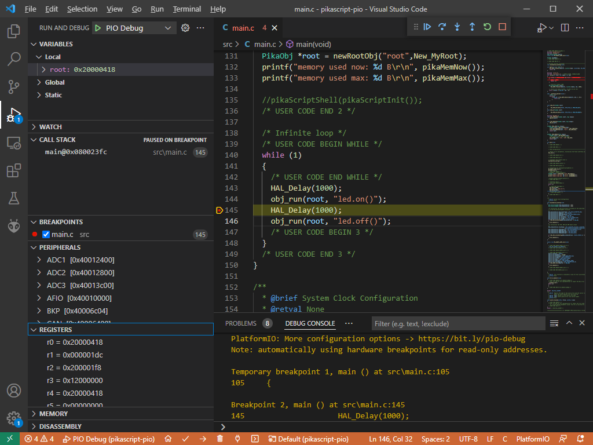

# PikaScript Bluepill Demo — Python-like REPL 🐍🔌

 
[](https://GitHub.com/maxgerhardt/pikascript-pio-bluepill/pulls/) [](https://GitHub.com/maxgerhardt/pikascript-pio-bluepill/issues/)

## Description

Uses the sources from http://pikascript.com/ for stm32f103c8, with all versions set to "latest". See https://github.com/pikasTech/pikascript.

Code adaptions based on https://github.com/pikasTech/pikascript-demo-stm32/tree/main/stm32f103c8t6/01-demo-pikascript-stm32f103c8t6-led.

And makes it a PlatformIO-compilable project, meaning you can install VSCode + PlatformIO extension (https://platformio.org/install/ide?install=vscode) and open the project and debug as normal.

The project opens a PikaScript shell on the UART console by calling into `pikaScriptShell()`. 

```cpp
  pikaMain = pikaScriptInit();
  // add special LED object to it
  obj_newObj(pikaMain, "led", "LED", New_LED);

  // start shell and stay there
  printf("Launching PikaScript shell.\r\n");
  pikaScriptShell(pikaMain);
```

## Media



## Output

At 115200 baud at (from the bluepill's view) TX = PA9 and RX = PA10.

Use e.g.
```sh
miniterm.py --eol LF COM6 115200
```
or any other serial terminal to establish a connection after flashing.

Initial bootup messsages:

```
======[pikascript packages installed]======
PikaStdDevice==latest
PikaStdLib==latest
STM32F1==latest
pikascript-core==latest
===========================================
memory used now: 156 B
memory used max: 848 B
Launching PikaScript shell.
>>> 
```

There is the special built-in `led` object that the firmware creates with `on()` and `off()` methods for PC13.

```py
>>> led.on()
>>> led.off()
```

Basic Python-like commands can be executed

```py
>>> 1 + 1
2
>>> 1.2 + 3.3
4.500000
>>> 2 ** 8
256.000000
>>> print("Hello" + " world")
Hello world
```

Special libraries can be imported as seen e.g. in the [example](https://github.com/pikasTech/pikascript/blob/master/examples/GPIO/main.py).

```py
>>> import PikaStdLib
>>> import machine
>>> mem = PikaStdLib.MemChecker()
>>> mem.max()
1.89 kB
>>> mem.now()
1.00 kB
>>>
```

Blinky code using the STM32F1 libary:

```py
>>> import STM32F1
>>> x = STM32F1.GPIO()
>>> x
>>> x.init()
>>> x.setPin('PC13')
>>> x.setMode('out')
>>> x.enable()
>>> x.low()
>>> x.high()
>>> x.low()
>>> x.high()
```

**Remember to always use 4 spaces as indentation. Nothing else will work!!** 

Basic loops:

```py
>>> for i in range(0,3):
...     print(i)
...
0
1
2
```

```py
>>> i = 0
>>> while i != 3:
...     print(i)
...     i += 1
...
0
1
2
```

Lists by using the PikaStdData classes (**these are not built-in!!**), see [docs](https://pikadoc.readthedocs.io/en/latest/PikaStdData%20%E6%95%B0%E6%8D%AE%E7%BB%93%E6%9E%84.html).

```py
>>> x = PikaStdData.List()
>>> x.append(1)
>>> x.append(2)
>>> x.len()
2
>>> for elem in x:
...     print(elem)
...
1
2
```

## Known issues

Some things don't yet work on the REPL: https://github.com/pikasTech/pikascript/issues
  * Function definitions: https://github.com/pikasTech/pikascript/issues/98
  * Class definitions: https://github.com/pikasTech/pikascript/issues/99
  * Lists, dicts etc. are not built-in: https://github.com/pikasTech/pikascript/issues/97